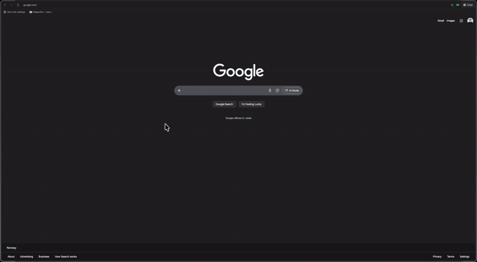

<p align="center">
  <a href="https://webtosvg.com">
    
  </a>
</p>

<p align="center">
  <strong>Click any element on a webpage and export it as a clean SVG or PNG.</strong>
  <br>
  A Chrome Extension for visually picking elements, previewing SVG output, and downloading or copying — with text outlining, Figma optimization, and PNG export.
  <br><br>
  <a href="https://webtosvg.com">Website</a> · <a href="#install">Install</a> · <a href="#contributing">Contributing</a>
  <br><br>
  <a href="LICENSE"></a>
</p>

<p align="center">
  
</p>

## Install

<!-- TODO: Replace with real Chrome Web Store URL -->

[**Get it on the Chrome Web Store**](#)

Or install manually from the [latest release](https://github.com/markusevanger/to-svg/releases):

1. Download and unzip the release
2. Open `chrome://extensions/` and enable Developer Mode
3. Click "Load unpacked" and select the unzipped folder

## Development

```bash
git clone https://github.com/markusevanger/to-svg.git
cd to-svg
pnpm install
pnpm dev:extension
```

Then load the extension:

1. Open `chrome://extensions/` and enable Developer Mode
2. Click "Load unpacked" and select `apps/extension/dist/`

## Features

- **Element picker** — hover and click to select any DOM element
- **SVG export** — converts elements to clean SVG, including ``, `<canvas>`, and `<video>`
- **PNG export** — configurable scale factor
- **Text outlining** — converts text to paths via opentype.js
- **Figma optimization** — collapses groups, converts paths to rects, normalizes coordinates
- **Copy to clipboard** — one-click SVG/PNG copy

## Project Structure

| Directory              | What it is                                          |
| ---------------------- | --------------------------------------------------- |
| `apps/extension/`      | Chrome Extension (Manifest V3)                      |
| `packages/svg-engine/` | Shared SVG conversion engine                        |
| `apps/web/`            | [webtosvg.com](https://webtosvg.com) — landing page |
| `apps/studio/`         | Sanity Studio for site content                      |

## Contributing

Contributions to the extension are welcome! See [CONTRIBUTING.md](CONTRIBUTING.md) for setup and guidelines.

## License

[MIT](LICENSE)

By [markusevanger.no](https://markusevanger.no)
